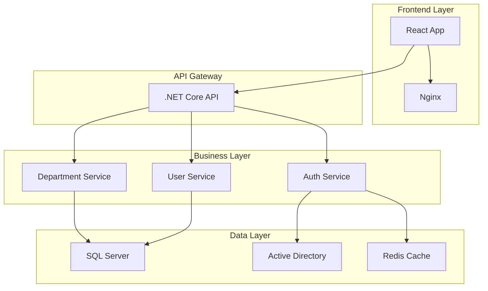

# Arquitetura do Portal Casa & Terra

## 📋 Visão Geral

O Portal Casa & Terra é uma aplicação corporativa moderna construída com arquitetura de microserviços, separando claramente o frontend (React) do backend (.NET Core), com integração ao Active Directory para autenticação e autorização.

## 🏗️ Arquitetura de Alto Nível



## 🎯 Padrões Arquiteturais

### Clean Architecture
- **Presentation Layer**: Controllers, DTOs
- **Application Layer**: Services, Interfaces
- **Domain Layer**: Entities, Business Rules
- **Infrastructure Layer**: Data Access, External Services

### SOLID Principles
- **Single Responsibility**: Cada classe tem uma única responsabilidade
- **Open/Closed**: Extensível sem modificação
- **Liskov Substitution**: Substituição de implementações
- **Interface Segregation**: Interfaces específicas
- **Dependency Inversion**: Dependência de abstrações

## 🔐 Segurança

### Autenticação
- **Active Directory Integration**: LDAP/AD authentication
- **JWT Tokens**: Stateless authentication
- **Refresh Tokens**: Token renewal mechanism

### Autorização
- **Role-Based Access Control (RBAC)**
- **Department-Based Permissions**
- **Claim-Based Authorization**

### Segurança de Comunicação
- **HTTPS Only**: Todas as comunicações criptografadas
- **CORS Policy**: Controle de origem cruzada
- **Security Headers**: Proteção contra ataques comuns

## 📊 Camadas da Aplicação

### Frontend (React + TypeScript)
```
src/
├── components/          # Componentes reutilizáveis
│   ├── auth/           # Autenticação
│   ├── dashboard/      # Dashboard
│   ├── layout/         # Layout
│   └── ui/            # Design System
├── contexts/          # Estado global
├── services/          # API calls
├── types/            # TypeScript definitions
└── utils/            # Utilitários
```

### Backend (.NET Core)
```
backend/
├── API/              # Controllers, Middleware
├── Core/             # Domain, DTOs, Interfaces
├── Infrastructure/   # Data Access, External Services
└── Tests/           # Unit & Integration Tests
```

## 🔄 Fluxo de Dados

### Autenticação
1. Usuário insere credenciais
2. Frontend envia para API
3. API valida no Active Directory
4. Retorna JWT token
5. Token usado em requisições subsequentes

### Acesso a Departamentos
1. Token JWT validado
2. Permissões extraídas do token
3. Departamentos filtrados por permissão
4. Dados retornados para frontend

## 🚀 Deployment

### Containerização
- **Docker**: Containerização de serviços
- **Docker Compose**: Orquestração local
- **Multi-stage builds**: Otimização de imagens

### Ambientes
- **Development**: Docker Compose local
- **Staging**: Kubernetes cluster
- **Production**: Azure/AWS cloud

## 📈 Escalabilidade

### Horizontal Scaling
- **Stateless API**: Múltiplas instâncias
- **Load Balancer**: Distribuição de carga
- **Database Clustering**: Alta disponibilidade

### Performance
- **Caching**: Redis para dados frequentes
- **CDN**: Assets estáticos
- **Database Indexing**: Consultas otimizadas

## 🔍 Monitoramento

### Logging
- **Serilog**: Logging estruturado
- **Correlation IDs**: Rastreamento de requisições
- **Log Levels**: Debug, Info, Warning, Error

### Métricas
- **Application Insights**: Telemetria
- **Health Checks**: Status dos serviços
- **Performance Counters**: Métricas de sistema

## 🧪 Testes

### Frontend
- **Jest**: Unit tests
- **React Testing Library**: Component tests
- **Cypress**: E2E tests

### Backend
- **xUnit**: Unit tests
- **Moq**: Mocking framework
- **TestContainers**: Integration tests

## 📚 Tecnologias Utilizadas

### Frontend Stack
- React 18.3.1
- TypeScript 5.5.3
- Vite 5.4.2
- Tailwind CSS 3.4.1
- Lucide React 0.344.0

### Backend Stack
- .NET 8.0
- ASP.NET Core Web API
- Entity Framework Core 8.0
- AutoMapper 12.0.1
- Serilog 8.0.0

### Infrastructure
- SQL Server 2022
- Redis 7
- Docker & Docker Compose
- Nginx (reverse proxy)

## 🔮 Roadmap

### Fase 1 (Atual)
- [x] Frontend React completo
- [x] Estrutura backend .NET Core
- [x] Containerização Docker

### Fase 2 (Próxima)
- [ ] Implementação completa do backend
- [ ] Integração real com Active Directory
- [ ] Testes automatizados

### Fase 3 (Futuro)
- [ ] Deploy em cloud (Azure/AWS)
- [ ] Monitoramento avançado
- [ ] CI/CD pipeline
- [ ] Mobile app (React Native)